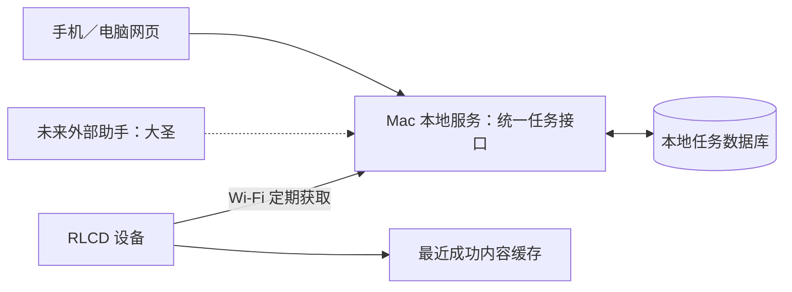

# 架构与目录职责

状态：目标架构，业务代码尚未实现。

## 模块边界

| 目录 | 职责 |
| --- | --- |
| `firmware/` | ESP-IDF 应用、屏幕驱动、字体、按键、联网与最近内容缓存 |
| `server/` | Mac 服务、数据持久化、任务读写和设备展示接口 |
| `server/web/` | 手机／电脑界面，调用服务接口，不维护独立任务库 |
| `scripts/` | 可复用环境、构建与调试入口；不包含个人路径和凭据 |
| `tests/` | 必要的协议、持久化、渲染边界测试与手工验收 |
| `docs/` | 产品、架构、硬件、开发与决策记录 |
| `local/` | 忽略的私有记录、响应、配置辅助文件与运行数据 |

第一版任务权威数据在 Mac 服务，设备缓存用于查看。未来助手通过同一服务入口写入，不直接操纵屏幕或写设备缓存。

## 接口边界

任务使用稳定编号，包含标题、分类、排序、完成状态和更新时间；外部写入另带来源名称、来源任务编号以支持幂等更新。设备取得带内容版本的分类展示数据，版本未变时不重绘任务画面。

此处确定接口能力与所有权，不在仓库初始化阶段生成路由、占位服务或数据库迁移。具体接口文档随最小闭环实现一并维护。

## 本地目录与可移植性

`vendor/` 为下载的完整官方源码，`validation` 可为指向本机英文路径示例的链接，`logs/` 保存原始日志，`docs/sources/` 保存下载的官方页面，均不提交。

配置通过环境变量或可信 `.env.local` 提供，示例在 `.env.example`。英文路径的验证工程独立于当前项目目录，避免 ESP-IDF 工具链的路径兼容问题。首次克隆不包含这些本地目录与链接。
