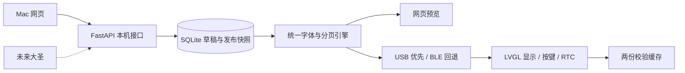

# 架构与接口

## 模块职责

- `server/`：数据库、接口、统一黑白页面渲染、发布调度及 USB/BLE 传输。
- `server/web/`：直接编辑三份清单，通过本机接口保存；不维护第二份任务库。
- `firmware/`：300×400 像素映射、LVGL 显示、按键、RTC、通信认证、缓存和确认。
- `scripts/`：环境、构建、服务启动／停止、验证入口。
- `local/`：私有配置、数据库、出厂备份、测试响应，全部忽略。

## HTTP API v1

只监听 `127.0.0.1:8765`。网页同源，拒绝跨站来源和任意 Host；不配置公网访问。

| 方法与路径 | 行为 |
| --- | --- |
| GET `/api/v1/state` | 草稿、最新发布内容、未发布修改标记、连接及确认状态 |
| POST `/api/v1/tasks` | 新增；同时提供 source/source_id 时幂等更新 |
| PUT `/api/v1/tasks/{id}` | 修改原文、分类、完成状态 |
| DELETE `/api/v1/tasks/{id}` | 删除草稿中的事项，不立即改变屏幕 |
| POST `/api/v1/tasks/{id}/move` | direction 为 -1 或 1，分类内移动 |
| POST `/api/v1/bulk` | text 逐行新增到 category，空行忽略 |
| POST `/api/v1/publish` | 在事务中生成不可变快照、排队发送，返回版本 |
| GET `/api/v1/preview?mode=draft或published` | 返回相同排版引擎生成的 PNG 页面 |

任务字段：id、text、category（focus/misc/follow）、position、done、updated_at（毫秒）、source、source_id。新增最低只需要 text/category。完整 OpenAPI 文档在运行后的 `/docs`。

## USB / BLE 协议 v1

每条消息为 `@RTD1 `＋一行 JSON＋换行；忽略其他日志。最大接收行 4095 字节。每条请求有 id、op、绑定 token，响应含 id、ok 或 error。

- hello：协议版本、稳定设备标识、发布版本，可信请求携带 epoch 校时。
- bind：首次通过 USB 保存随机 32 位十六进制 token，Mac 保存到私有数据库。
- begin：size、version、sha256，限 128KiB。
- chunk：offset、base64 data，USB 每次 384、BLE 每次 2048 原始字节，顺序严格匹配并确认偏移。
- end：校验、解析、双缓存持久化、显示，再确认 version。

USB 握手后优先。BLE 使用认证加密特征值，读特征触发 macOS 配对。GATT 服务 UUID `beef1000-5e7a-4a61-9d20-e848672f0001`，RX/TX 分别为 `beef1001`/`beef1002` 同后缀。BLE 按协商 MTU 分片写入，读取匹配 id 的响应。双通道共享同一发布状态，传输失败重发整份最新快照。

二进制快照：小端 `RTD3`、uint64 版本、uint64 发布时间（秒）、uint16 页数，随后为整份页面主体的 zlib 压缩流。解压后每页包含 uint8 分类、uint16 分类内页码、uint16 分类页数、uint32 数据长度（15000），随后为平铺单色数据。最多 128 页，解压缓冲有明确上限；按像素连续打包，不能使用 300 宽图片的行补齐字节。固件兼容早期 RTD1/RTD2 缓存，欢迎页仍使用简单游程编码。

设备缓存为独立 flash 分区，数据先写，带 SHA-256 的有效头最后写；启动选择校验通过的最高版本。未完成传输不修改当前画面。设备确认意味着数据已持久化、SPI 刷新已返回；视觉效果仍需人眼验收。
