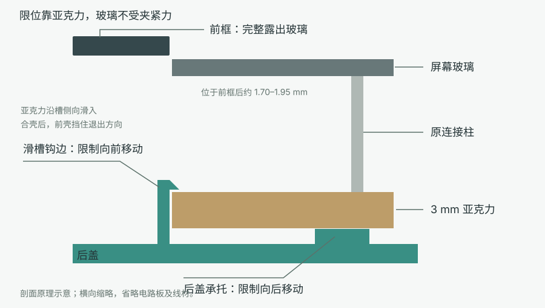

# 显示器侧挂外壳 · 第五版

适配 Waveshare ESP32-S3-RLCD-4.2 与 Dell P2421DC 的侧挂外壳。2026-10-09，项目使用者确认本版完成并接受当前方案。此记录代表这套实物的整体接受，不代表已做长期承重、疲劳或通用适配认证。

前壳、后盖、独立支架共三件。设备通过亚克力滑槽固定，不需胶或新增螺丝；支架与后盖使用 502，显示器侧使用可移除胶。外壳不再提供按键，配合固件的自动轮播使用；原设备开关仍保留在内部。

## 已确认尺寸与基准

所有尺寸单位为 mm。描述方向时，以屏幕正面朝观察者、设备 USB-C 朝上为准；安装臂和 USB-A 出口在右侧。源文件保留原建模坐标并统一镜像，不能单独反转某个零件。

| 项目 | 第五版 |
| --- | --- |
| 玻璃和亚克力外轮廓 | 宽 69 × 高 97，四边齐平 |
| 玻璃正面至亚克力背面 | 14 |
| 亚克力自身厚度 | 3 |
| 主体外形，不含外伸支架 | 宽 81 × 高 156 × 厚 18.8 |
| 前窗 | 69.4 × 97.4，完整露出玻璃 |
| 玻璃正面低于前框 | 名义范围 1.70–1.95 |
| 亚克力槽高／左右总间隙 | 3.25／0.4 |
| 四个外壳卡扣 | 相对第四版，钩头横向 +0.4、从盖内面伸出高度 -0.7 |
| 显示器曲面补偿 | 17°，独立件 |
| 小屏相对大显示器正面 | 后退约 10；不是屏幕在小盒内后退 10 |
| 线材 | 原有 50 cm USB 线，设备端直插头突出约 30 |

`usb_reference_u()`、`top_connector_reference_u()` 和设备参考实体用于检查空间，不是厂家提供的完整机械模型。USB-A 塑料体采用 23 × 14 × 10 的参考包络，原螺丝头采用直径 6.8、凸高 1 的参考包络；这些尺寸未逐项精确实测。换线、换底板或换显示器需重新核对。

## 文件与导出

- [enclosure.scad](enclosure.scad)：已接受版的完整 OpenSCAD 源文件，含三个零件、整盘、装配与参考碰撞视图。
- [export.py](export.py)：导出三件 STL、整盘 STL/3MF，检查网格封闭性、面方向、独立实体、尺寸和摆盘。
- [check_fit.py](check_fit.py)：检查前后壳、设备、胶接面、滑入路径和参考线材包络；完整走线运算可能需要数分钟。
- [经验记录](lessons.md)：多轮实物试装的缺陷、原因及改进方法。

使用 Python 3 标准库与 OpenSCAD。将 `openscad` 加入 PATH，或将 `OPENSCAD` 环境变量设为 OpenSCAD 可执行文件路径。在项目根目录运行：

```bash
python3 mechanical/export.py
# 修改装配或走线几何后再运行：
python3 mechanical/check_fit.py
```

导出到忽略目录 `local/mechanical/export/`：`stl/` 中为三个独立零件，`enclosure-v5-plate.3mf` 和同名 STL 为三件整盘模型，`validation/` 为本机检查结果。Git 保存源文件和复现方法；打印工程、切片、G-code、缓存与日志留在本地。

OpenSCAD 中默认显示整盘；修改开头的 `part` 可切换 `shell`、`cover`、`bracket`、`assembly` 或 `exploded`。`device_check` 等检查选项是诊断用，不用于打印。

复现时所用版本：OpenSCAD 2021.01，Bambu Studio 02.08.02.61。几何源文件从本地已接受第五版原样纳入版本控制，没有改变尺寸。

## 打印设置

P2S、0.4 mm 喷嘴、纹理 PEI 板，选择 **Bambu PETG HF @BBL P2S 0.4 nozzle**。层高 0.20，4 层墙，20% 填充，2 mm 外裙边；普通自动支撑、仅从打印板生成，保留桥接不生成支撑的设置。

导入整盘 3MF 时保留三个独立对象及现有朝向：前壳正面贴床，后盖外背面贴床，支架侧面贴床。不要把零件当多色组合件重新居中，也不要自动改变朝向或缩放。整盘模型不包含耗材与机器预设，导入后按上述配置切片。

当时的 P2S / PETG HF 切片无模型警告，未生成支撑路径，保留短桥接和裙边；预计 **63.8 g、约 1 小时 59 分钟**。这是切片预测，不是实测重量或打印时间。软件版本、材料配置和摆放变化后应重新查看预览。

## 装配



1. 清理裙边和毛刺，不装设备先扣合空壳，检查四钩进入窗口、接缝自然闭合。拆开时从窗口轻按钩头，逐侧松开。
2. 后盖外背面朝下，上方带两个绑线孔的是线仓。从相反的下端，让亚克力两边对准四段短滑槽，沿盖平面滑向上端止挡。玻璃朝上，USB-C 朝线仓；用亚克力或连接柱附近受力，不按玻璃，也不要从正上方硬压入滑槽。
3. USB-A 横放在前壳下方，金属头从右侧伸出。塑料体承托台高 6.7，目标 USB 轴线距前框正面 11.9。对应 10／9／8 厚的塑料头，目标垫胶约 0.2／0.7／1.2；先试插，保证金属头能完整插入，不以接口承重。
4. 接好设备端 USB-C，上方自由线仓宽松收纳余线。回线沿原按钮侧下行，在下方转向 USB-A，避开原开关和卡扣。必要时用保留的孔配合细扎带或普通胶带理线。
5. 对准前壳合上后盖。前壳下端止挡封住滑槽入口，玻璃外轮廓由短定位筋限制。确认设备不明显窜动、玻璃不突出前框、没有夹线并能通信。
6. 干装顺畅后，先取出设备和线材。将独立支架的宽、窄定位舌分别放进后盖盲槽，再按胶水说明处理粘接面、薄涂 502、压合并完全固化。定位舌用于对齐，主要依靠根部平面胶接承力。胶接完成后重新装机。
7. 手扶整机试插显示器 USB，检查 17° 贴面的适配与朝向，再用可移除胶固定显示器侧。502 只用于打印支架与后盖，不能用于显示器。确认固定前保持手托。

四段滑槽限制亚克力前后及左右位置，前壳合盖封住退出方向，所以前窗不必压住玻璃黑边。装配留有小间隙，不能把“无胶限位”理解为零间隙强压。前后壳与支架应使用同一版，不能混用旧件。

## 验证边界

模型已检查封闭网格、单盘范围、前后壳名义配合、设备及参考接头空间、设备滑入路径；切片记录与使用者的整体接受分别保留。完整 50 cm 余线没有逐段做三维模拟，槽口手感、卡扣耐久和长期胶接强度没有定量试验数据。几何修改后应先局部试装，再打印整套。

装配受力参考 [Waveshare 官方说明](https://docs.waveshare.com/ESP32-S3-RLCD-4.2)，胶接参考 [Prusa 的打印件胶接说明](https://blog.prusa3d.com/the-great-guide-to-gluing-and-assembling-3d-prints_44908/)。材料和机器预设由本机 Bambu Studio 提供，本目录未复制第三方预设。原创模型随项目暂未选择许可证。
